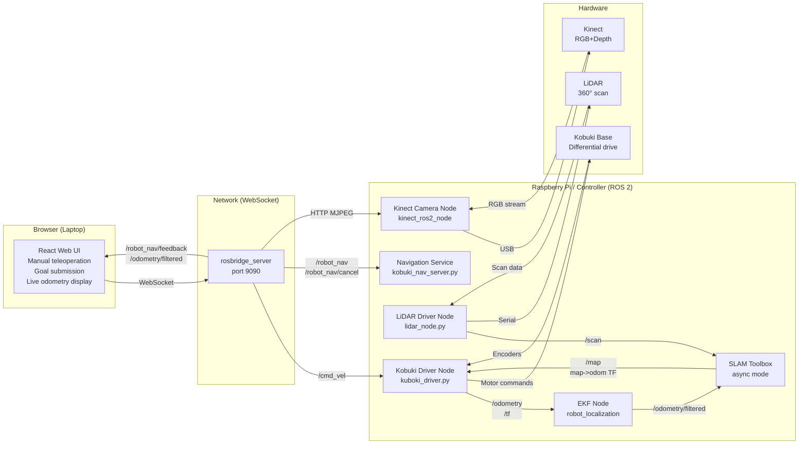

# TK Botz — Kobuki Robot Control System

A complete ROS 2 control system for a real **Kobuki mobile robot** with **LiDAR** and **Kinect camera**. Includes a custom React web interface for teleoperation and autonomous navigation, communicating via rosbridge_server over WebSocket.

---

## Table of contents

- [Overview](#overview)
- [System architecture](#system-architecture)
- [Repository structure](#repository-structure)
- [Hardware requirements](#hardware-requirements)
- [Installation](#installation)
- [Running the system](#running-the-system)
- [Web interface](#web-interface)
- [ROS 2 interfaces](#ros-2-interfaces)
- [Troubleshooting](#troubleshooting)

---

## Overview

TK Botz is a production robot control stack for the **Kobuki base** integrated with:

- **LiDAR** — 360° 2D scanning for SLAM and obstacle detection
- **Kinect camera** — RGB + depth stream for vision tasks
- **EKF + SLAM Toolbox** — Localization and real-time mapping
- **React web UI** — Browser-based dashboard for teleoperation and autonomous navigation
- **Service-based navigation** — Safe goal submission and cancellation without action clients

---

## System architecture



---

## Repository structure

```
final-project-tk_botz/
├── app_interface/                    # Web UI
│   └── ros-web-app/                  # React frontend
│       ├── src/
│       │   ├── App.js                # Main component: joystick, navigation, odom
│       │   ├── App.css               # Dashboard styling
│       │   └── index.js              # React entry point
│       └── package.json
│
├── ROS/botz_workspace/               # ROS 2 workspace
│   └── src/
│       ├── kobuki_driver/            # Robot driver package (Python)
│       │   ├── kobuki_driver/
│       │   │   ├── kobuki_node.py    # Main driver: motor commands, odometry
│       │   │   ├── kuboki_driver.py  # Low-level Kobuki serial interface
│       │   │   ├── kobuki_nav_server.py  # Navigation service handler
│       │   │   └── nav_action_server.py  # Legacy action server (commented)
│       │   ├── launch/
│       │   │   ├── robot_stack_launch.py # Main launch: Kobuki + LiDAR + SLAM
│       │   │   ├── kobuki_ekf_launch.py  # EKF node
│       │   │   ├── slam_launch.py        # SLAM Toolbox
│       │   │   └── ekf_launch.py
│       │   ├── config/
│       │   │   ├── ekf_config.yaml       # EKF filter config
│       │   │   └── slam_async_config.yaml
│       │   └── setup.py
│       │
│       ├── kobuki_interfaces/        # Message + Service definitions (C++)
│       │   ├── srv/
│       │   │   ├── RobotNav.srv      # Goal pose service
│       │   │   └── CancelRobotNav.srv # Cancel service
│       │   ├── msg/
│       │   │   ├── RobotNavFeedback.msg  # Progress updates
│       │   │   ├── RobotNavGoal.msg
│       │   │   └── RobotNavResult.msg
│       │   ├── action/
│       │   │   └── RobotNav.action   # (Legacy, not used via rosbridge)
│       │   ├── CMakeLists.txt
│       │   └── package.xml
│       │
│       ├── lidar_driver/             # 2D LiDAR driver (Python)
│       │   ├── lidar_driver/
│       │   │   ├── lidar_node.py     # Publishes /scan
│       │   │   ├── lidar_driver.py   # Serial communication
│       │   │   └── crc_utils.py
│       │   ├── launch/
│       │   │   └── lidar_launch.py
│       │   └── setup.py
│       │
│       └── kinect_ros2/              # Kinect RGB-D camera (C++)
│           ├── src/
│           │   ├── kinect_ros2_node.cpp   # Publishes /image_raw
│           │   └── kinect_ros2_component.cpp
│           ├── launch/
│           │   └── pointcloud.launch.py
│           ├── cfg/
│           │   ├── calibration_rgb.yaml
│           │   └── calibration_depth.yaml
│           ├── CMakeLists.txt
│           └── package.xml
│
├── Dev.md                            # Hardware setup notes (udev rules, SSH config)
├── SYSTEM_ARCHITECTURE.md            # Detailed system design
└── README.md                         # This file
```

## Hardware requirements

| Component | Notes |
|---|---|
| **Kobuki Base** | Differential-drive robot with encoders |
| **2D LiDAR** | Serial interface (currently: YDLIDAR X4) |
| **Kinect Camera** | RGB-D sensor (Kinect v1 or Kinect for Windows) |
| **Raspberry Pi 4** | 8 GB RAM + Ubuntu 22.04 LTS (or better) |
| **Network** | Robot connected to laptop via SSH/ROS_DOMAIN_ID |

---

## Installation

### 1. Prerequisites on Raspberry Pi / Robot Controller

```bash
# Install ROS 2 Jazzy
sudo apt update
sudo curl -sSL https://repo.ros2.org/ros.key | sudo apt-key add -
sudo add-apt-repository universe
sudo apt update
sudo apt install ros-jazzy-desktop

# Install essential packages
sudo apt install python3-pip git ros-jazzy-rosbridge-server \
  ros-jazzy-slam-toolbox ros-jazzy-robot-localization \
  ros-jazzy-ros2-control

# Install Python dependencies
pip3 install pyserial

# Add udev rules for Kobuki and LiDAR (see Dev.md)
```

### 2. Clone and build the ROS workspace

```bash
cd ~
git clone <repo-url> tk_botz
cd tk_botz/ROS/botz_workspace

# Install ROS dependencies
rosdep install --from-paths src --ignore-src -r -y

# Build
colcon build --symlink-install
source install/setup.bash

# Add to ~/.bashrc
echo "source ~/tk_botz/ROS/botz_workspace/install/setup.bash" >> ~/.bashrc
```

### 3. Set up the web UI (on laptop or same machine)

```bash
cd app_interface/ros-web-app

# Install Node.js dependencies
npm install

# Update IP addresses in src/App.js (lines 5-6)
# controller_ip = "xxx.xxx.xxx.xxx"  # or Robot Controller's IP
# rpi_ip = "xxx.xxx.xxx.xxx"          # raspberryPi's IP
```

---

## Running the system

### Start the ROS backend stack

On the **Raspberry Pi** (or robot controller):

```bash
# Terminal 1: rosbridge_server
ros2 run rosbridge_server rosbridge_websocket --ros-args -p port:=9090

# Terminal 2: Full robot stack (Kobuki + LiDAR + EKF + SLAM)
cd ~/tk_botz/ROS/botz_workspace
source install/setup.bash
ros2 launch kobuki_driver robot_stack_launch.py \
  kobuki_port:=/dev/kobuki \
  lidar_port:=/dev/lidar
```

This starts:
- `kobuki_node` — Motor control and odometry publishing
- `lidar_node` — 2D LiDAR scanning
- EKF node — Fuses odometry + IMU data
- SLAM Toolbox — Real-time mapping and localization
- `kobuki_nav_server` — Service endpoint for navigation goals

### Start the web interface

On your **laptop** (or same machine):

```bash
cd ~/tk_botz/app_interface/ros-web-app
npm start
```

Open **http://localhost:3000** in your browser. The UI will attempt to connect to the robot at the IP configured in `App.js`.

---

## Web interface

The React dashboard provides:

### Control Panel (Joystick)
- **Virtual joystick** — Drag to move the robot forward/backward and rotate
- **CMD_VEL publishing** — Real-time velocity commands (max 0.4 m/s linear, 0.6 rad/s angular)
- **Live velocity display** — Shows current linear and angular velocity values

### Navigation Panel
- **Goal submission** — Enter target X, Y coordinates and click "START NAVIGATION"
- **Calls `/robot_nav` service** — Backend accepts goal and begins autonomous navigation
- **Status feedback** — Displays navigation state and distance to goal from `/robot_nav/feedback`

### Cancellation
- **Cancel button** — Calls `/robot_nav/cancel` service to stop active navigation
- No rosbridge action clients used (more reliable over lossy networks)

### Live Displays
- **Odometry** — Robot X, Y position and yaw angle from `/odometry/filtered`
- **Status indicator** — Connection status and system messages
- **Camera stream** — MJPEG stream from the Kinect at `/image_raw` (HTTP endpoint)

---

## ROS 2 interfaces

### Topics published by backend

| Topic | Type | Rate | Notes |
|---|---|---|---|
| `/cmd_vel` | `geometry_msgs/Twist` | On demand | Manual teleoperation commands |
| `/odometry/filtered` | `nav_msgs/Odometry` | ~30 Hz | Robot pose after EKF fusion |
| `/scan` | `sensor_msgs/LaserScan` | ~10 Hz | 2D LiDAR scan (from lidar_driver) |
| `/map` | `nav_msgs/OccupancyGrid` | ~1 Hz | Occupancy grid from SLAM |
| `/image_raw` | `sensor_msgs/Image` | ~30 Hz | Kinect RGB stream |
| `/robot_nav/feedback` | `kobuki_interfaces/RobotNavFeedback` | ~5 Hz | Navigation progress updates |

### Services

| Service | Type | Called by | Response |
|---|---|---|---|
| `/robot_nav` | `kobuki_interfaces/RobotNav` | Web UI (start goal) | `success: bool`, `message: string` |
| `/robot_nav/cancel` | `kobuki_interfaces/CancelRobotNav` | Web UI (cancel goal) | `success: bool`, `message: string` |

### Transforms (TF)

| Frame | Parent | Published by | Notes |
|---|---|---|---|
| `base_link` | `odom` | EKF node | Robot body frame |
| `odom` | `map` | SLAM Toolbox | Odometry frame |
| `map` | (root) | SLAM Toolbox | Global map frame |
| `base_laser` | `base_link` | LiDAR driver | LiDAR sensor frame |
- Streams compressed image data via rosbridge---

## Troubleshooting

### Web UI won't connect to robot

**Problem**: "Connection Failed - Is rosbridge running?"

**Solution**:
1. Verify rosbridge is running on the robot: `ros2 run rosbridge_server rosbridge_websocket`
2. Check the IP address in `App.js` matches your robot's address
3. Verify network connectivity: `ping <robot-ip>`
4. Check firewall allows port 9090: `sudo ufw allow 9090`

### Joystick commands not moving the robot

**Problem**: Virtual joystick works but robot doesn't move

**Solution**:
1. Check kobuki_node is running: `ros2 node list`
2. Verify `/cmd_vel` is being published: `ros2 topic echo /cmd_vel`
3. Check USB connection to Kobuki: `lsusb | grep Kobuki`
4. Verify udev rules are set up (see `Dev.md`)

### Navigation goal not accepted

**Problem**: "Goal failed" message when submitting goal

**Solution**:
1. Check `kobuki_nav_server` is running: `ros2 node list`
2. Test the service directly: `ros2 service call /robot_nav kobuki_interfaces/srv/RobotNav '{pose: {header: {frame_id: "map"}, pose: {position: {x: 1.0, y: 0.0, z: 0.0}, orientation: {x: 0, y: 0, z: 0, w: 1}}}}'`
3. Check SLAM has started mapping: `ros2 topic echo /map`
4. Verify odometry is being published: `ros2 topic echo /odometry/filtered`

### LiDAR not publishing scans

**Problem**: `/scan` topic is empty

**Solution**:
1. Check LiDAR is connected: `lsusb | grep -i lidar`
2. Verify serial port: `ls -la /dev/lidar`
3. Check lidar_node is running: `ros2 run lidar_driver lidar_node`
4. Test serial connection: `cat /dev/lidar | hexdump -C`

### Kinect camera not streaming

**Problem**: Camera display shows "MJPEG Stream failed"

**Solution**:
1. Check Kinect is detected: `lsusb | grep -i kinect`
2. Verify image publisher is running: `ros2 topic list | grep image`
3. Test image reception: `ros2 topic echo /image_raw --once`
4. Ensure no libfreenect conflicts: `dpkg -l | grep freenect`

### rosbridge_server crashes on startup

**Problem**: "Address already in use" or segmentation fault

**Solution**:
1. Kill any existing rosbridge processes: `pkill -f rosbridge`
2. Wait 5 seconds and retry
3. Check port 9090 is not blocked: `sudo lsof -i :9090`
4. Try alternate port: `ros2 run rosbridge_server rosbridge_websocket --ros-args -p port:=9091`

---

## Hardware setup notes

See **Dev.md** for:
- Udev rules for permanent USB device names (`/dev/kobuki`, `/dev/lidar`)
- SSH configuration for Raspberry Pi access
- Network bridging between Raspberry Pi and laptop

---

## Code structure

### Frontend (React)

**App.js** (~600 lines):
- `VirtualJoystick` component — Touch/mouse-based teleoperation
- roslib instance management — Connection to rosbridge_server
- `publishCmdVel()` — Publishes joystick input to `/cmd_vel`
- `sendNavGoal()` — Calls `/robot_nav` service
- `cancelNavGoal()` — Calls `/robot_nav/cancel` service
- Subscriptions to `/odometry/filtered` and `/robot_nav/feedback`
- MJPEG camera stream display via HTTP

### Backend (ROS 2 Python)

**kobuki_driver/kobuki_node.py**:
- ROS 2 node entry point
- Subscribes to `/cmd_vel`, drives motor
- Publishes odometry from wheel encoders

**kobuki_driver/kuboki_driver.py**:
- Low-level Kobuki serial communication
- Encoder reading and motor command encoding
- Thread-based command/event loops

**kobuki_driver/kobuki_nav_server.py**:
- Service handler for `/robot_nav`
- Feedback publisher on `/robot_nav/feedback`
- Navigation state machine (Idle → Moving → Goal reached)

**lidar_driver/lidar_node.py**:
- LiDAR serial reader
- Converts raw packets to `/scan` (LaserScan messages)

**kobuki_interfaces/srv/RobotNav.srv**:
```
geometry_msgs/PoseStamped pose
---
bool success
string message
```

**kobuki_interfaces/msg/RobotNavFeedback.msg**:
```
float32 distance_remaining
string status
```

---

## Future improvements

- [ ] Nav2 integration for path planning
- [ ] Real-time map visualization in the UI
- [ ] Multi-goal queue submission
- [ ] Obstacle avoidance using LiDAR data
- [ ] Depth image processing from Kinect
- [ ] RViz alternative web viewer for map + robot pose
- [ ] Mobile-responsive UI improvements

---

## Contributors

- Tharaka Jayasena
- Nidharshan

---

## License

Apache 2.0
